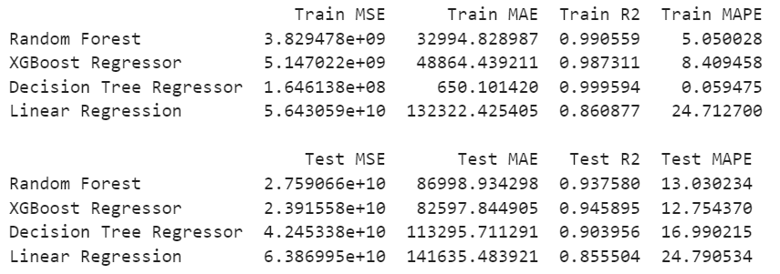
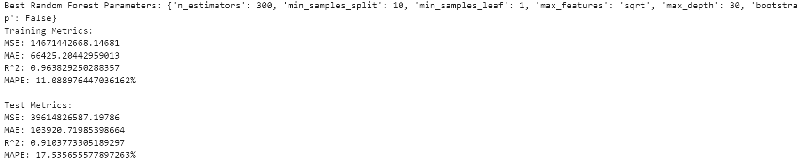
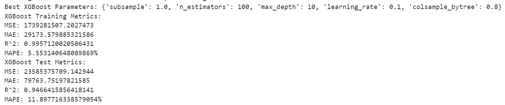
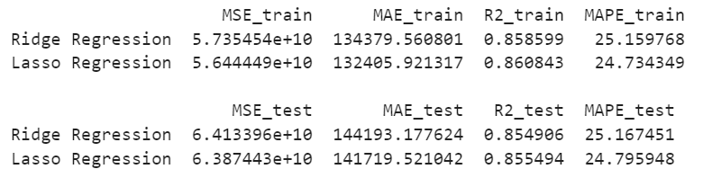
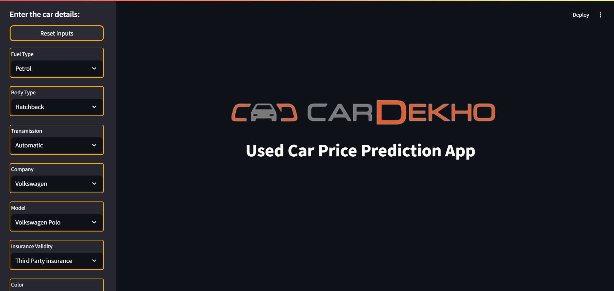
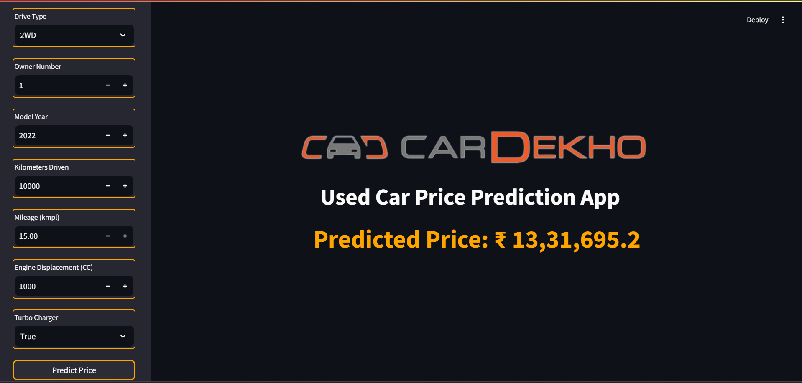

# Car Dekho - Used Car Price Prediction 

## Skills Takeaway From This Project
- Data Cleaning and Preprocessing
- Exploratory Data Analysis
- Machine Learning Model Development
- Price Prediction Techniques
- Model Evaluation and Optimization
- Model Deployment
- Streamlit Application Development
- Documentation and Reporting

## Domain
Automotive Industry, Data Science, Machine Learning

## Problem Statement:
### Objective:
To leverage machine learning to enhance the customer experience and streamline the pricing process. You will develop a user-friendly tool that accurately predicts used car prices based on various features. This interactive web application will cater to both customers and sales representatives, ensuring seamless usage for all.

## Project Scope:
Using the historical data on used car prices from CarDekho, including various features such as make, model, year, fuel type, transmission type, and other relevant attributes from different cities. My task as a data scientist is to develop a machine learning model that can accurately predict the prices of used cars based on these features. The model should be integrated into a Streamlit-based web application to allow users to input car details and receive an estimated price instantly.

## Approach:
### Data Processing
- **Import and Concatenate**: Import all city datasets in unstructured format and convert them into a structured format. Add a new column named ‘City’ and assign values for all rows with the respective city name. Concatenate all datasets into a single dataset.
- **Handling Missing Values**: Identify and fill or remove missing values in the dataset. For numerical columns, use techniques like mean, median, or mode imputation. For categorical columns, use mode imputation or create a new category for missing values.
- **Standardizing Data Formats**: Check for all data types and perform necessary steps to maintain correct formats. For example, if a data point has string formats like "70 kms", remove the unit "kms" and change the data type from string to integer.
- **Encoding Categorical Variables**: Convert categorical features into numerical values using encoding techniques. Use one-hot encoding for nominal categorical variables and label or ordinal encoding for ordinal categorical variables.
- **Normalizing Numerical Features**: Scale numerical features to a standard range, usually between 0 and 1 (for necessary algorithms). Apply techniques like Min-Max Scaling or Standard Scaling.
- **Removing Outliers**: Identify and remove or cap outliers in the dataset to avoid skewing the model. Use IQR (Interquartile Range) method or Z-score analysis.

### Exploratory Data Analysis (EDA)
- **Descriptive Statistics**: Calculate summary statistics to understand the distribution of data, including mean, median, mode, and standard deviation.
- **Data Visualization**: Create visualizations to identify patterns and correlations using scatter plots, histograms, box plots, and correlation heatmaps.
- **Feature Selection**: Identify important features that significantly impact car prices using techniques like correlation analysis, feature importance from models, and domain knowledge.

### Model Development
- **Train-Test Split**: Split the dataset into training and testing sets to evaluate model performance, commonly using a 70-30 or 80-20 split ratio.
- **Model Selection**: Choose appropriate machine learning algorithms for price prediction, such as Linear Regression, Decision Trees, Random Forests, and Gradient Boosting Machines.
- **Model Training**: Train the selected models on the training dataset, utilizing cross-validation techniques for robust performance.
- **Hyperparameter Tuning**: Optimize model parameters to enhance performance using techniques like Grid Search or Random Search.

### Model Evaluation
- **Performance Metrics**: Evaluate model performance using relevant metrics like Mean Absolute Error (MAE), Mean Squared Error (MSE), and R-squared.
- **Model Comparison**: Compare different models based on evaluation metrics to select the best performing model.

### Optimization
- **Feature Engineering**: Create new features or modify existing ones to improve model performance using domain knowledge and insights from exploratory data analysis.
- **Regularization**: Apply regularization techniques to prevent overfitting, including Lasso (L1) and Ridge (L2) regularization.

### Deployment
- **Streamlit Application**: Deploy the final model using Streamlit to create an interactive web application that allows users to input car features and receive real-time price predictions.
- **User Interface Design**: Ensure the application is user-friendly and intuitive, providing clear instructions and error handling.

## Results:
- A functional and accurate machine learning model for predicting used car prices.
- Comprehensive analysis and visualizations of the dataset.
- Detailed documentation explaining the methodology, models, and results.
- An interactive Streamlit application for real-time price predictions based on user input.

## Project Evaluation Metrics:
- **Model Performance:** Evaluated using Linear Regression, Decision Tree Regressor, Random Forest Regressor, and XGB Regressor.
  

- **Hyperparameter Tuning:** Tuned the hyperparameters and retrained the models.
  - **Random Forest:** Tuning using Random Search CV.
  

  - **XGBoost:** Tuning using Random Search CV.
  

- **Regularization Techniques:** Applied Lasso and Ridge regularization.
  

### Conclusion for Best Model
- The **XGBoost Regressor** after hypertuning outperformed all models, achieving the lowest Test MSE, MAE, and MAPE, along with the highest R² score of **0.946**.
- The **Random Forest** model followed closely as the second-best performer, demonstrating strong metrics.
In summary, **XGBoost** is the optimal model for predicting used car prices in this project.

## App screenshots:
### Home page


### Price prediction based on the input feautures


## Technical Tags:
Data Preprocessing, Machine Learning, Price Prediction, Regression, Python, Pandas, Scikit-Learn, Exploratory Data Analysis (EDA), Streamlit, Model Deployment.

### File Descriptions:
- **Dataset/**: Contains multiple Excel files, each representing historical used car data for different cities. Each file includes columns detailing car specifications, features, and prices.
- **screenshots/**: Stores images showcasing the final application interface and key evaluation metrics, useful for documentation and presentation purposes.
- **streamlit_app/**: This folder contains the code for the Streamlit application. The `home.py` file serves as the main entry point for the web app, while any images used in the app are included here.
- **.gitignore**: A file that specifies which files and directories should be ignored by Git, ensuring that unnecessary files are not tracked.
- **Data pipeline_cardekho.ipynb**: A Jupyter Notebook that contains all the code for data processing, model development, and evaluation, serving as a comprehensive guide to the project's implementation.
- **Preprocessed_data.xlsx**: An Excel file that contains the dataset after applying preprocessing steps, making it ready for machine learning modeling.
- **README.md**: The documentation file that provides an overview of the project, including its objectives, methodologies, results, and technical details.
- **combined_unpacked_df_full.xlsx**: An Excel file that presents the complete unpacked dataset combining all cities data into one file.
- **encoded_columns.pkl**: A serialized file that contains the final encoded dataset used for training and testing the machine learning model.
- **requirements.txt**: A text file listing all required dependencies for the project, generated from the `pip freeze` command to facilitate environment setup.
- **xgboost_ml_model.pkl**: A saved model file that contains the trained XGBoost model for predicting used car prices, which can be loaded for inference in the Streamlit application.

## Setup

1. Clone the repository:
   ```bash
   git clone https://github.com/naveen-pulivarti/Used-car-price-prediction-ML-app-CarDekho.git
   cd Used-car-price-prediction-ML-app-CarDekho

2. Create and activate a virtual environment:
  python -m venv venv
  source venv/bin/activate   # On Linux/Mac
  venv\Scripts\activate      # On Windows

3. Install the required dependencies:
  pip install -r requirements.txt

## Project Deliverables:
- Source code for data preprocessing and model development.
- Documentation detailing the methodology, models used, and evaluation results.
- Visualizations and analysis reports derived from the exploratory data analysis.
- Final predictive model with a user guide.
- Deployed Streamlit application for price prediction.
- Justification for the method of approach and model selection.
